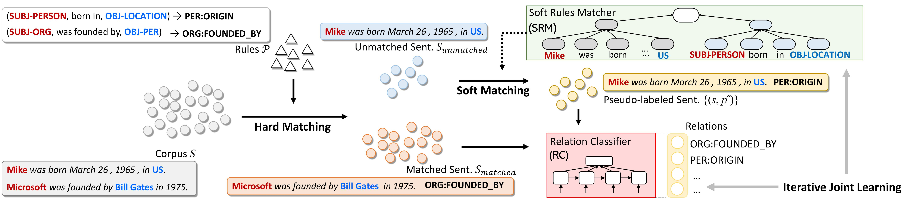
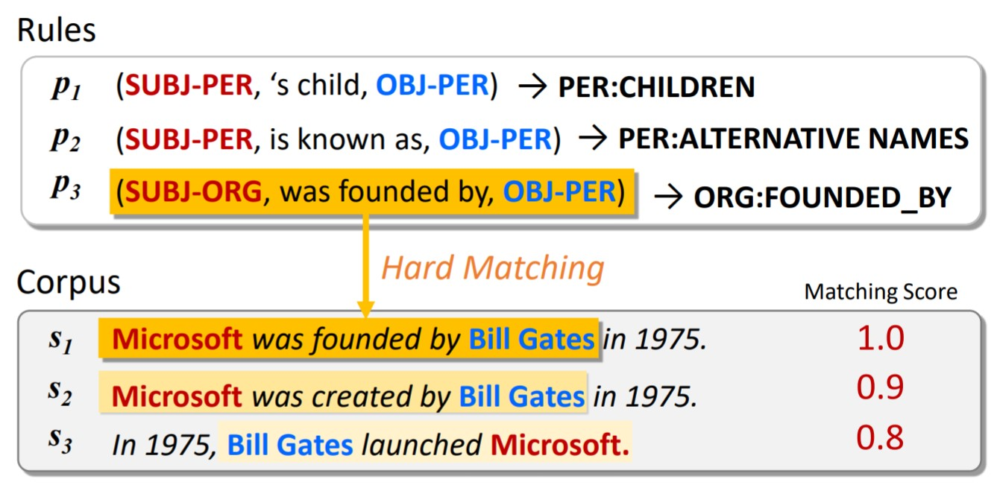

# NERO
Code for WWW 2020 paper [NERO: A Neural Rule Grounding Framework for Label-Efficient Relation Extraction](https://arxiv.org/abs/1909.02177).

Deep neural models for relation extraction tend to be less reliable when perfectly labeled data is limited, despite their success in label-sufficient scenarios. Instead of seeking more instance-level labels from human annotators, here we propose to annotate frequent surface patterns to form labeling rules. These rules can be automatically mined from large text corpora and generalized via a soft rule matching mechanism. Prior works use labeling rules in an exact matching fashion, which inherently limits the coverage of sentence matching and results in the low-recall issue. In this paper, we present a neural approach to ground rules for RE, named NERO, which jointly learns a relation extraction module and a soft matching module. One can employ any neural relation extraction models as the instantiation for the RE module. The soft matching module learns to match rules with semantically similar sentences such that raw corpora can be automatically labeled and leveraged by the RE module (in a much better coverage) as augmented supervision, in addition to the exactly matched sentences. Extensive experiments and analysis on two public and widely-used datasets demonstrate the effectiveness of the proposed NERO framework, comparing with both rule-based and semi-supervised methods. Through user studies, we find that the time efficiency for a human to annotate rules and sentences are similar (0.30 vs. 0.35 min per label). In particular, NERO’s performance using 270 rules is comparable to the models trained using 3,000 labeled sentences, yielding a 9.5x speedup. Moreover, NERO can predict for unseen relations at test time and provide interpretable predictions.

<p align="center"></p>

If you make use of this code or the rules in your work, please kindly cite the following paper:

```bibtex
@article{zhou2019neural,
  title={Neural Rule Grounding for Low-Resource Relation Extraction},
  author={Zhou, Wenxuan and Lin, Hongtao and Lin, Bill Yuchen and Wang, Ziqi and Du, Junyi and Neves, Leonardo and Ren, Xiang},
  journal={arXiv preprint arXiv:1909.02177},
  year={2019}
}
```

## Quick Links
* [Requirements](#requirements)
* [Motivation](#motivation)
* [Labeling Rules](#labeling-rules)
* [Train and Test](#train-and-test)

## Motivation
Supervised neural models yield state-of-the-art results on relation extraction task, but their performance has a heavy reliance on sufficient training labels. To alleviate the problem, recent works (e.g. [Stanford Snorkel](https://hazyresearch.github.io/snorkel/)) propose to construct a large labeled dataset from labeling rules. They perform exact string matching on the unlabeled dataset, and a sentence is either matched or not matched by a rule. However, this hard-matching method fails to annotate sentences with similar meanings but different words, which consequently cause the low-recall problem and data-insufficiency for training neural networks. In this paper, we argue that the rule matching should not be performed solely based on the surface forms (strings), but also on the semantic meanings. We measure the similarity between sentences and rules with matching scores that are calculated on their neural representations (e.g. word embedding) and label each sentence with its most similar rule.
<p align="center"></p>

## Labeling Rules
Labeling rules can either be crafted by domain experts, or automatically mines from large corpora with a knowledge base. In this work, we adopt a hybrid apporach. We first extract the frequent patterns from large raw corpora, then ask human annotators to assign labels to the patterns. In this way, we get 270 rules on TACRED dataset (located in``/data/tacred/pattern.json``) and 164 rules on SemEval 2010 dataset (located in``/data/semeval/pattern.json``). 


## Requirements
Tensorflow-gpu == 1.10 \
tqdm \
ujson

## Train and Test
Before running, download dataset from [TACRED](https://nlp.stanford.edu/projects/tacred/) and [SemEval](https://drive.google.com/file/d/0B_jQiLugGTAkMDQ5ZjZiMTUtMzQ1Yy00YWNmLWJlZDYtOWY1ZDMwY2U4YjFk/view?sort=name&layout=list&num=50) and put them under ``/data``. Also download [Glove embedding](http://nlp.stanford.edu/data/glove.840B.300d.zip) and unzip it to ``/data/glove/glove.840B.300d.txt``.

To train the relation extraction model on TACRED / SemEval dataset, run

```bash
python3 tacred.py / semeval.py
```

The model will be automatically evaluated on dev and test dataset after each training epoch. After training, the code will choose the model that achieves best performance on dev dataset and return its test score.
